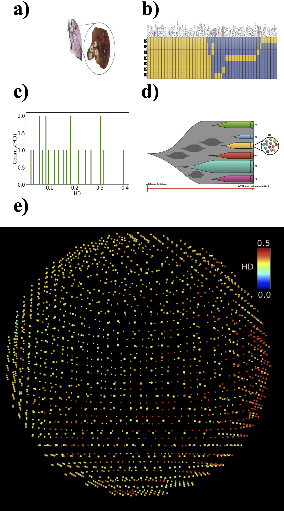

# Spatial-genetic-heterogeneity
Statistical Mechanical theory for spatio-temporal evolution of Intra-tumor
heterogeneity in cancers: Analysis of Multiregion sequencing data



## 📌 Overview
This repository contains the **MATLAB**, **C++** code and **data analysis scripts** used in our paper:

> **"Statistical Mechanical theory for spatio-temporal evolution of Intra-tumor
heterogeneity in cancers: Analysis of Multiregion sequencing data"**  
> **Authors:** Sumit Sinha, Xin Li, and D. Thirumalai  
> **Published in:** *arXiv:2202.10595*
> **DOI:** [arXiv:2202.10595](https://arxiv.org/abs/2202.10595)  

This repository contains the MATLAB/C++ code, data analysis scripts used to develop and validate a statistical mechanical model for intra-tumor heterogeneity (ITH). The model predicts spatial and temporal genetic variations within a single tumor and is validated against multi-region sequencing (M-Seq) data for skin, lung, and kidney cancers..

---

## 📂 Repository Structure
```text
/Glass-to-Fluid-Solid-tumors
│── code/         # MATLAB & Python scripts for simulations
│   ├── matlab/   # MATLAB-specific scripts
│── data_analysis_scripts/         # Processed simulation data
│── README.md     # Project documentation
│── LICENSE       # Licensing information
```


---

## 🚀 Getting Started
### 1️⃣ Clone the Repository
To download the code, use:
```sh
git clone https://github.com/sumit-sinha-seas/Spatial-genetic-heterogeneity.git
cd Spatial-genetic-heterogeneity
```

### 2️⃣ Running the Simulations
#### **MATLAB**
To run the MATLAB simulation, open MATLAB and execute:
``` matlab
run('code/ith_3d.m')
```


## 🔬 Key Findings
- New analytical expression for ITH based on cell division and mutation probabilities.
- Comparison with experimental M-Seq data from various cancer types..
- Simulations illustrating spatial ITH variations across different tumor regions.


## 📜 Citation
If you use this code in your research, please cite our paper:
```bibtex
@article{sinha2022statistical,
  title={Statistical Mechanical theory for spatio-temporal evolution of Intra-tumor heterogeneity in cancers: Analysis of Multiregion sequencing data},
  author={Sinha, Sumit and Li, Xin and Thirumalai, Dave},
  journal={bioRxiv},
  pages={2022--02},
  year={2022},
  publisher={Cold Spring Harbor Laboratory}
}
```
